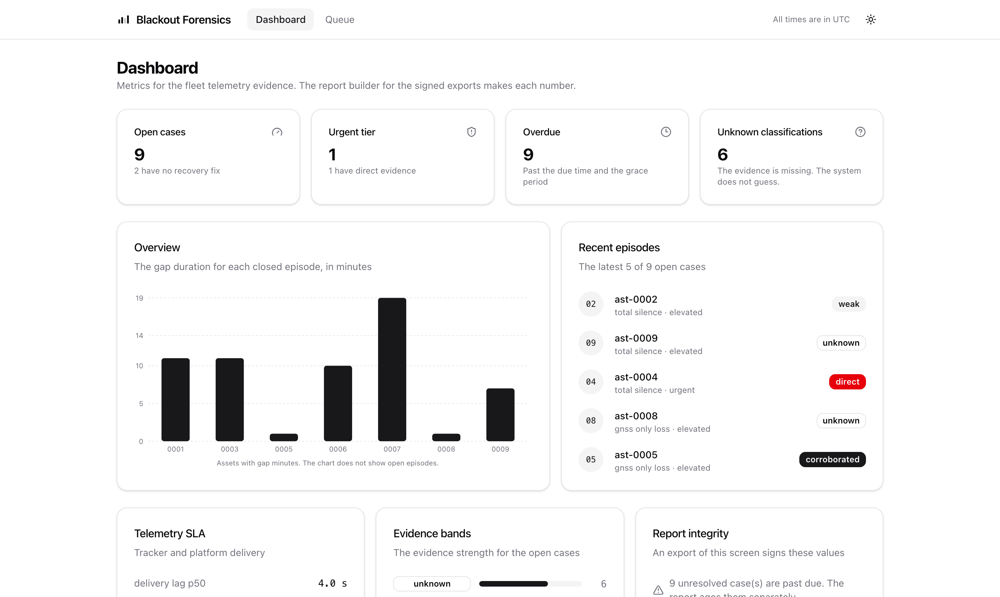
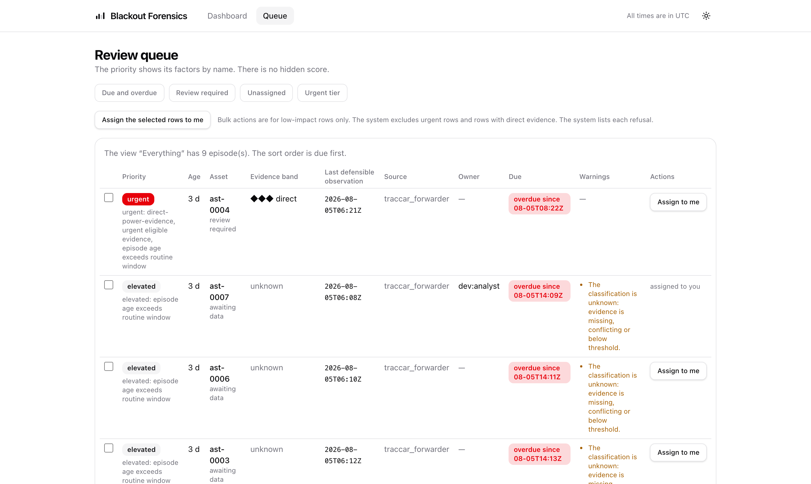

<!--
SPDX-FileCopyrightText: 2026 David Rukahu
SPDX-License-Identifier: AGPL-3.0-only
-->

# Blackout Forensics

A vendor-neutral system for telemetry evidence and recovery control. It is made for financed
motorcycles and vehicles.

A GPS tracker can stop its reports for many causes. The cause can be expected sleep, a coverage
gap, a platform delay, a dead SIM, a disconnected battery, a failed device, interference, or
theft. A financier cannot see the difference without evidence. This system turns the silence into
an evidence record. The record contains a probable explanation and the counterevidence. The
system puts the case in a queue. A person works the queue.

**The system does not make consequential decisions.** The system cannot repossess a vehicle. The
system cannot immobilise a vehicle. The system cannot contact a borrower. The system cannot
change a credit state. The system cannot dispatch a recovery. Priority sets the investigation
order only. Priority is not proof, blame, or authorisation.

**The dashboard.** The report builder makes each number. The same builder makes the signed
exports. The integrity hash on the screen is the hash that an export signs.



**The review queue.** The priority shows its factors by name. There is no hidden score. The
system excludes urgent rows and rows with direct evidence from bulk actions. A person must review
those rows one at a time.



**Case review.** Each hypothesis shows its supporting evidence, its counterevidence, and its
missing expected evidence. Each hypothesis shows the rule identifier and the rule version.


All interface text follows ASD-STE100 Simplified Technical English. The dark-mode control stores
your choice. The application applies the choice before the first paint.

## Quick start

```bash
npm install
npm run check
npm run dev -w @blackout/app
```

Open <http://localhost:5173>. The [developer guide](documentation/developer.md) shows the full
synthetic demonstration. The [documentation set](documentation/README.md) covers operators,
administrators, developers, data-protection officers, and incident response.

## Repository layout

| Package | Licence | Contents |
|---|---|---|
| `packages/spec` | Apache-2.0 | The canonical event schema, the adapter manifest contract, and the conformance fixtures. The project publishes this package to [blackout-spec](https://github.com/davidrukahu/blackout-spec). |
| `packages/core` | AGPL-3.0-only | The episode engine, the evidence rules, the queue domain, and the audit functions. |
| `packages/connectors` | Apache-2.0 | The source adapters and the conformance kit. |
| `packages/sdk` | Apache-2.0 | The client libraries. |
| `packages/app` | AGPL-3.0-only | The server-rendered queue, case review, metrics, and administration screens. |

## Stack

The language is TypeScript on Node 24 LTS. Postgres with PostGIS is the single query engine. The
audit container includes the same engine. The audit container runs the identical analyser code
that the product runs. The web application uses React Router 7. The tests use Vitest,
`fast-check`, and Testcontainers. The data layer uses `postgres.js`, so `SET LOCAL
app.tenant_id` stays explicit and testable.

## Evidence

Each acceptance claim has linked evidence. See
[`release/v1-acceptance-pack.md`](release/v1-acceptance-pack.md) for all acceptance items. The
[`release/`](release/) directory contains the signed release manifest, the SBOMs, the acceptance
packs, the security verification, the disaster-recovery exercise, and the benchmark results.

## Decisions

The architecture decision records are in [`docs/adr/`](docs/adr/). The threat model is in
[`documentation/threat-model.md`](documentation/threat-model.md).

## Licences

The core and the application are AGPL-3.0-only. The interoperability spec is Apache-2.0. A
closed-source product can implement the spec. The spec lives at
[blackout-spec](https://github.com/davidrukahu/blackout-spec). The REUSE tool checks the licence
boundary in CI.
