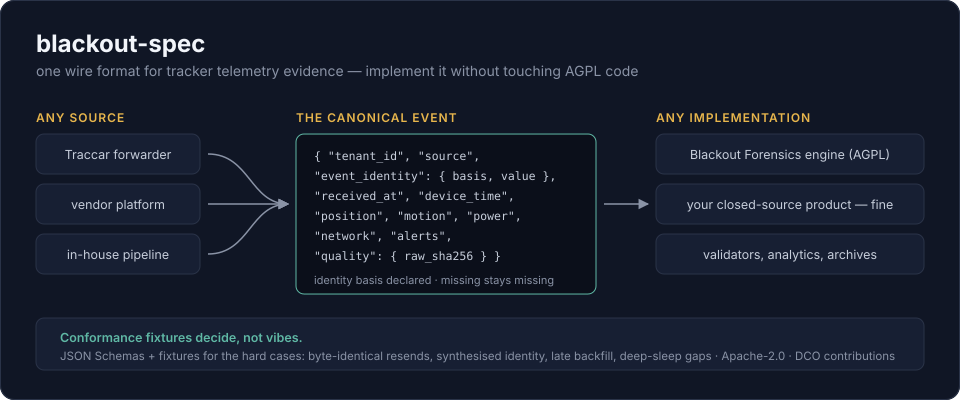

<!--
SPDX-FileCopyrightText: 2026 David Rukahu
SPDX-License-Identifier: Apache-2.0
-->

# @blackout/spec

Canonical event schema, adapter manifest contract and conformance fixtures. Published publicly.

**Licence: Apache-2.0.**

