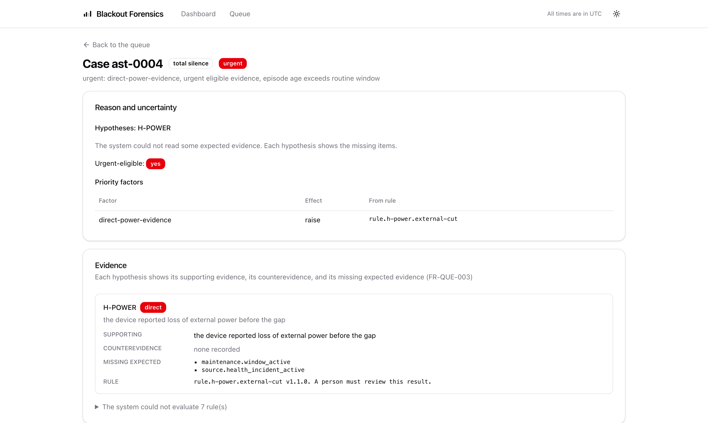

<!--
SPDX-FileCopyrightText: 2026 David Rukahu
SPDX-License-Identifier: Apache-2.0
-->

# blackout-spec

One wire format for tracker telemetry evidence. The licence is Apache-2.0.

A GPS tracker can stop its reports for many causes. Evidence work needs one canonical record of
what each source received. This package defines that record. Any source can emit the canonical
event. Any implementation can consume the canonical event. The conformance fixtures verify each
implementation. A closed-source implementation is welcome. This package is separate from the
AGPL engine.

The screen above is Blackout Forensics. It is one implementation that consumes this format. Each
evidence field on that screen comes from canonical events.

## Contents

| Directory | Contents |
|---|---|
| `schema/` | The JSON Schemas for the canonical event and the findings bundle. |
| `src/` | The TypeScript types and the validators. |
| `fixtures/` | The conformance fixtures. The fixtures include the hard cases: byte-identical resends, synthesised identity, late backfill, and deep-sleep gaps. |

## The canonical event

Each event carries the tenant, the source, the device reference, the receipt time, the event
identity, the raw hash, and the adapter version. The identity declares its basis: a vendor event
identifier, a vendor sequence, or a synthesised value. A missing field stays missing. The format
does not permit a guessed value.

## Conformance

The fixtures decide conformance. Run the validators against the fixtures. An implementation that
passes the fixtures reads and writes the format correctly.

## Contributions

Contributions use the Developer Certificate of Origin (DCO). Sign your commits with
`git commit -s`.

## Source

A generator in the [blackout-forensics](https://github.com/davidrukahu/blackout-forensics)
repository makes this repository. An allowlist controls the export. Do not send pull requests
that change generated files only. Open an issue instead.
